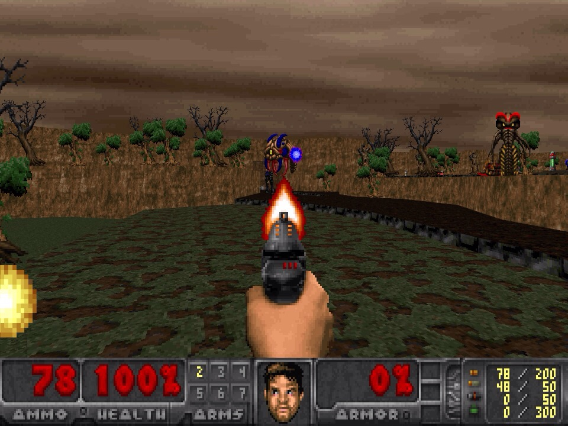
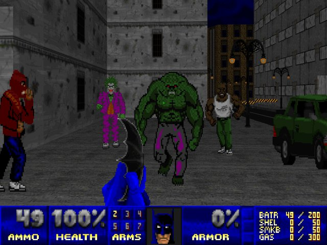
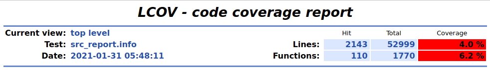
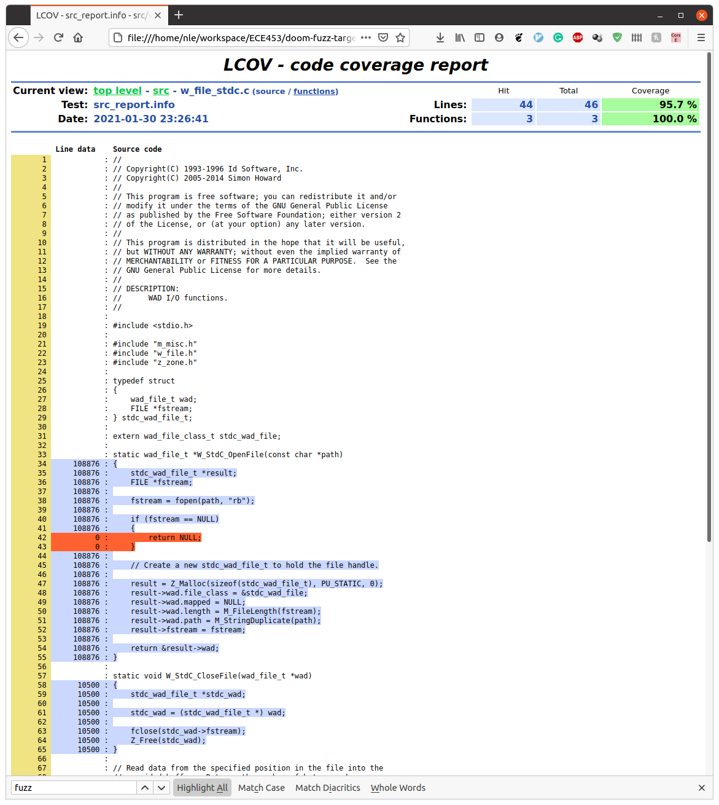

# DOOM FUZZING BATTLE

In this special assignment, we will fuzz Doom - one of the most famous computer games ever created! 

__Fun fact 1__: Doom was originally compiled using WATCOM, a C compiler created by The University of Waterloo!

__Video Tutorial__: <https://youtu.be/uvWi8RanG9s>

## Table of contents

- [Doom](#doom)
- [What are we fuzzing?](#what-are-we-fuzzing)
- [How do we fuzz it](#how-do-we-fuzz-it)
- [Grading](#grading)
- [I get the files to compile. Now what?](#i-get-the-files-to-compile-now-what)
- [What files can I change?](#what-files-can-i-change)
- [What should I submit?](#what-do-i-submit)
- [TIPS AND HINTS](#tips-and-hints)
- [References](#references)

## Doom


From Wikipedia:
> Doom (stylized as DooM, and later DOOM) is a video game series and media franchise created by John Carmack, John Romero, Adrian Carmack, Kevin Cloud, and Tom Hall.[1] The series focuses on the exploits of an unnamed space marine operating under the auspices of the Union Aerospace Corporation (UAC), who fights hordes of demons and the undead.

> Doom is considered one of the pioneering first-person shooter games, introducing to IBM-compatible computers features such as 3D graphics, third-dimension spatiality, networked multiplayer gameplay, and support for player-created modifications with the Doom WAD format. Since its debut in 1993, over 10 million copies of games in the Doom series have been sold; the series has spawned numerous sequels, novels, comic books, board games, and film adaptations. 

Since then, Doom has been open-sourced and ported to everything under the sun: [scientific calculator](https://www.youtube.com/watch?v=nduMTX86Zl0), [Macbook's touchbar](https://www.theverge.com/circuitbreaker/2016/11/21/13697058/macbook-touchbar-doom-hack-sure-why-not), [pregnancy test](https://kotaku.com/doom-running-on-a-pregnancy-tests-screen-1844978428), you name it. 

While the original Doom code is freely available [here](https://github.com/id-Software/DOOM), it is not really friendly with modern systems, so it has been forked and updated, creating what we now call *Doom source port*. For this assignment, we are using [Chocolate-Doom](https://www.chocolate-doom.org/wiki/index.php/Chocolate_Doom).

From this point on, we will use Doom and Chocolate-Doom interchangeably.

### WAD files and Freedoom
Created to be fully mod-able in mind, Doom supports loading user-created assets into the game. Those asset files are called WAD files, which contains map definitions, texture information, enemy sprites, etc. For example, to run the original game, we run
```
chocolate-doom -iwad freedoom.wad
```
and to run the sequel DOOM 2, since they use the same rendering engine, we can just run
```
chocolate-doom -iwad freedoom2.wad
```
We can also load multiple WAD files at the same time, so that people can create custom maps by using original assets. For example, to run the famous [Batman-Doom](https://www.doomworld.com/idgames/themes/batman/batman), we run
```
chocolate-doom -iwad freedoom2.wad -file BATMAN.WAD
```
__Fun fact 2__: John Carmark was looking for a name for the file extension. Upon asking "How do you call a file Where's All the Data?", his colleague Tom Hall responded: "A WAD"?


Most WAD files are archived over [here](https://www.doomworld.com/idgames/).

__Fun fact 3__: While Doom source code is free, its assets are not. But since users can load any assets into it, free-to-use assets WADs based on Doom's original assets were created, and we are using one such WAD file in this assignment, called Freedoom. Doom's community loves word-play: Chocolate-Doom itself is a play on ... vanilla Doom. 
## What are we fuzzing?
In this assignment, we will fuzz the wad reader (`chocolate-doom/src/w_wad.c`) and the map builder in Doom (`chocolate-doom/src/doom/p_setup.c`). In order to do so, we have created a minimal fuzzing target for you at fuzz_target.c, which is an adaptation of `chocolate-doom/src/doom/d_main.c` (the original main game loop). At a high level, the main loop is:
```c
//From Game Engine Black Book: Doom, by Fabien Sanglard
void main(void){
    FindResponseFile(); // load the wad file specified in -iwad
    IdentifyVersion(); // setup the correct version of the game (doom1 or doom2?)

    V_Init(); // Init the video systems
    M_LoadDefaults(); // Load params from default.cfg
    Z_Init(); // Memory Allocator
    
    LoadOtherIWADs(); /** load the wad specified in -file **/
    
    //only at this point, that we can init game-specific systems
    M_Init(); // Init menu
    R_Init(); // Init renderer
    P_Init(); //Init Playloop state
    S_Init(); //Init Sound
    
    G_InitNew(); //Finally the game is setup here
    
    D_DoomLoop(); // Start a never-return gameplay loop
}

```
The fuzz target will get a random blob of data, turns it into a WAD file, and feeds the WAD file to Doom. If the blob is not rejected by the parser in `chocolate-doom/src/w_wad.c`, it will eventually reach the `G_InitNew()`, where the map will be created in `chocolate-doom/src/doom/p_setup.c`. Knowing this will help you understand our grading scale in [Grading](#grading).
## How do we fuzz it?


### Update your course repository with the skeleton

```
# go to your course repository
cd stqam
# update from the skeleton 
git fetch upstream
git merge upstream/master
# push to GitLab
git push origin master
```

### Setup the working environment
__You can do this assignment using Docker or your own local environment. If you want to do it on your local environment, refer to the `docker/fuzz-doom.Dockerfile` to see what dependencies you will need.__ 

Here we provide instructions to build Chocolate-Doom and the provided target
inside the provided Docker image. If you want to build the code in your own
environment instead of inside Docker, feel free to do so. You may need to adapt
the below cmake commands, for example, in the docker container `clang-10` is
name of the C compiler that supports fuzzing. On my mac, the compiler is called
`clang-mp-10`. The default version of clang that ships with XCode does not seem
to work.


#### Get the docker image and run it
On an Intel-based Windows, Linux, or an Older Mac:
```bash
docker pull uwstqam/fuzz-doom
docker run -dit --name FuzzDoom uwstqam/fuzz-doom
```

On a new ARM-based Mac:
```bash
docker pull uwstqam/fuzz-doom:m1
docker run -dit --name FuzzDoom uwstqam/fuzz-doom
```


The first command downloads the correct version of our image, called `fuzz-doom`,
from Docker Hub. The second command starts the container, with a local name
`FuzzDoom` in the background.

#### Access the docker environment
```bash
docker exec -it FuzzDoom /bin/bash
```

This command opens a shell inside the container. You can execute it multiple
times to login multiple times (for example, in different terminals).

### Build Chocolate-Doom and the fuzzing target
To build Chocolate-Doom and the provided fuzzing target, do
```bash
git clone https://git.uwaterloo.ca/stqam-1239/class/USER.git stqam
# this will create a new directory `fb` for fuzz battle
cd stqam/fb
# checkout our version of chocolate-doom
git clone https://git.uwaterloo.ca/stqam-1239/chocolate-doom.git
mkdir build ; cd build
cmake -DCMAKE_C_COMPILER=clang-10 -DCMAKE_EXPORT_COMPILE_COMMANDS=ON \
      -DCMAKE_C_FLAGS='-fsanitize=fuzzer-no-link,address -fprofile-instr-generate -fcoverage-mapping -g -ggdb3 -O2' \
      ../ -GNinja
ninja
```

The above command compiles everything using [Ninja](https://ninja-build.org/).
You can use `make` instead if you prefer. `CMAKE_C_FLAGS` has the options to
enabled fuzzing, AddressSanitizer, and coverage. You should not need to change
them. However, you may want to try enabling additional sanitizers, or disable
AddressSanitizer.
 
We are using our own version of Chocolate Doom that has been improved for
fuzzing. To see what we have changed, look at the commit [history].

[history]: https://git.uwaterloo.ca/stqam-1239/chocolate-doom/-/commits/fuzz/

To run the fuzz target, in the `build` directory, run
```bash
./src/doom_fuzz -runs=2  >/dev/null
```
This runs two rounds of fuzzing. You should see a lot of `Direct leak of ...` lines printed out. These messages are benign because the fuzz target leaks memory on exit. You can instruct AddressSanitizer to disregard them
```bash
#disable leak detection
export ASAN_OPTIONS="detect_leaks=0" 
./src/doom_fuzz -runs=2 -detect_leaks=0  >/dev/null
```

The fuzz target comes with many options. You can list all of them using:
```bash
./src/doom_fuzz -help=1
```

You may want to research how these options can help achieve better coverage. You
may find the option `use_value_profile` particularly interesting.

### Generate the coverage report
If you follow the above instruction, your fuzz target will be able to generate a _profile file_. Those files can be combined to generate a coverage report, telling you how much of the code has been touched during fuzzing. 
```bash
cd build
#disable leak detection
export ASAN_OPTIONS=detect_leaks=0 
#set the fuzzer profile output format
export LLVM_PROFILE_FILE='pf-%p' 
#run the target in parallel. This will run 8 fuzz jobs in parallel, restrict each run to 10 iterations, and 
#overall will run 100 jobs, using the seed folder SEED, and the corpus folder CORPUS
./src/doom_fuzz -runs=10  CORPUS SEED -jobs=100 -workers=8 -detect_leaks=0 >/dev/null
#check if we have generated any profile files
ls pf-*
#you should see few files like pf-2044576, etc.
# collect all the prof file paths into a single file
ls pf-* > all_prof_files
# merge all prof files into a single file 
llvm-profdata-10 merge -sparse -f all_prof_files -o default.profdata
# export the above file into a format that can be easily parsed
llvm-cov-10 export ./src/doom_fuzz -instr-profile=default.profdata -format=lcov > src.info
# generate text report
lcov -a src.info -o src_report.info
# generate a html visualization of the same report
genhtml -o html_output src_report.info
```

More details on clang coverage are
[here](https://clang.llvm.org/docs/SourceBasedCodeCoverage.html#running-the-instrumented-program).
Details on `lcov` graphical front-end are [here](http://ltp.sourceforge.net/coverage/lcov.php).

### libFuzzer options
The key options that you may want to change are

* `-runs=N` number of tests to run. The fuzz target exits after that many runs.
  Small numbers are inefficient, large numbers may not scale on your machine.
  
* `-jobs=N` number of times to run the fuzz target. In the beginning, omit this
  option to see immediate output from the fuzz target. When the option is
  enabled, all output is redirected to log files.
  
* `-workers=N` number of fuzz target to run in parallel. 

For example, `-runs=10 -jobs=2 -workers=1` runs the fuzz target twice, the runs
are sequential, and each run does 10 tests, and `-runs=10 -jobs=2 -workers=2`
runs the fuzz target twice in parallel.

### Coverage
The commands after the fuzz target above generate a coverage report. The final
command, `genhtml`, generates the report in HTML. For every file, it shows the
details of what exactly was covered.

## Grading
Our main fuzzing targets in this assignment are `chocolate-doom/src/w_wad.c` and
`chocolate-doom/src/doom/p_setup.c`, and your grade will be based on the line
coverage of those functions

__Grade scale__: Outstanding (95%), Excellent (89%), Very Good (75%), Satisfactory (%65), Unsatisfactory (38%)

__Unsatisfactory__
: You get nothing to work, but you write what you have done in the report.

__Satisfactory__
: any % line coverage for `chocolate-doom/src/doom/p_setup.c`, and >59% line
  coverage for `chocolate-doom/src/w_wad.c`

__Very Good__
: >79%+ line coverage for `chocolate-doom/src/doom/p_setup.c`, and >59% line
  coverage for `chocolate-doom/src/w_wad.c`

__Excellent__
: get >79% line coverage for `chocolate-doom/src/doom/p_setup.c`, and >79% line
  coverage for `chocolate-doom/src/w_wad.c`

__Outstanding__
: get >79% line coverage for `chocolate-doom/src/doom/p_setup.c`, >79% line
  coverage for `chocolate-doom/src/w_wad.c`, >15% __total line coverage__ (the
  top `Lines` row in your `index.html`, as in the below screenshot.)


__1% bonus__
: Compile DooM on your local machine, load a WAD file in it and play the game!
  Take a screenshot and you get 1% bonus. (Your TA knows how to do reverse image
  search so please don't just take a photo from Google. The goal is for you to
  have fun.)
  
__EXTRA BONUS__: Extra bonus points will be given for discovering interesting
bugs, achieving significant over what is required, improving code for better (or
faster) fuzzing. Tell us in your report if you believe you deserve the EXTRA
BONUS. Exact details of the EXTRA BONUS will be released after grading. This is
the second time that we have the Fuzz Battle, so this is as new to us as it is to
you.

## I get the files to compile. Now what?
Start with looking at the html report (see [TIPS AND HINTS](#tips-and-hints)). 

Try to get inputs that cover more parts of the code. Modify the code if needed.

You can also create multiple fuzz targets, each one targeting a different part of the code.
## What files can I change?
You cannot change the `chocolate-doom/src/doom/p_setup.c` and `chocolate-doom/src/w_wad.c`

Other than that, feel free to change anything, but be reasonable (remove all the unused files to boost your total line coverage is not nice!).

## What do I submit?
You are required to submit:
- A report written in Markdown format detailing in file `REPORT.md`: 
  (a) What have you done to compile and run the fuzzing target (using Docker or local environment, etc.)
  (b) What tricks have you done to increase the number of line coverage 
  (c) Do you find any bugs? If yes, a log detailing the bug. It should look like
```
AddressSanitizer:DEADLYSIGNAL
=================================================================
==513601==ERROR: AddressSanitizer: SEGV on unknown address (pc 0x00000058b653 bp 0x7fff04ba11f0 sp 0x7fff04ba1190 T0)
==513601==The signal is caused by a READ memory access.
==513601==Hint: this fault was caused by a dereference of a high value address (see register values below).  Dissassemble the provided pc to learn which register was used.
    #0 0x58b653 in R_PrecacheLevel /home/nle/workspace/ECE453/fb/build/../chocolate-doom/chocolate-doom/src/doom/r_data.c:882:19
    #1 0x577969 in P_SetupLevel /home/nle/workspace/ECE453/fb/build/../chocolate-doom/chocolate-doom/src/doom/p_setup.c:868:2
    #2 0x5006a1 in G_DoLoadLevel /home/nle/workspace/ECE453/fb/build/../chocolate-doom/chocolate-doom/src/doom/g_game.c:657:5
    #3 0x478f69 in LLVMFuzzerTestOneInput /home/nle/workspace/ECE453/fb/build/../chocolate-doom/src/fuzz_target.c:322:3
```
__Note that since fuzzing is not deterministic, you may or may not find the same bug as your TA.__

- Your merged prof file ( the `build/default.profdata` in the above guide) and your final report ( the `build/src_report.info` in the above guide)
- Commit any changes that you have done to `fuzz_target.c`. If you have multiple fuzz targets, commit all of them.
- If you modify `chocolate-doom`, submit a patch. Do not put `chocolate-doom` itself into your repository! 
  Instructions to create a git patch are [here](https://gist.github.com/deanrather/44bf0d4988730ecf1e7d)
- If you do the bonus, submit a screenshot of Doom running on your machine, named `bonus_screenshot.jpg`.
- While you are not required to submit your corpus, keep it on your machine in case you are asked to submit it later (we will read your report and if what you did is too far off your results, we will ask for your corpus).
In your skeleton folder, the files you submit for this assignment should be placed as follows :

```
├── a0
├── a1
├── fb 
│   ├── user.yml                       <==== Personal information
│   ├── CMakeLists.txt
│   ├── doc_imgs
│   ├── docker
│   ├── freedoom-0.12.1
│   ├── README.md                       <==== This file 
│   ├── report                          <==== Your report folder
│   │   ├── bonus_screenshot.jpg
│   │   ├── default.profdata
│   │   ├── src_report.info
│   │   ├── report.md                   <==== This file template has been created for you.
│   │   └── chocolate-doom.patch
│   ├── src
└── README.md
```

## TIPS AND HINTS
### Make your life with Docker easier
__Please try to use volume mapping with Docker__

If you cant, the following tricks may make your life easier 
- Moving files into the Docker container, e.g copy a script into the container:
```
docker cp run-fuzzing.sh FuzzDoom:/home/doom/fb
```

- Moving files out of the Docker container, e.g copy the html report out of docker so you can open it in browser:
```
docker cp FuzzDoom:/home/doom/fb/html_output docker_html_out
```
- Using VSCode to directly edit/browse files inside the container:
[Attach to a running container](https://code.visualstudio.com/docs/remote/attach-container)

### Use the generated html report to guide your effort
The generated html report is an interactive report that you can use to see which part of the code has been covered, and see why certain parts of the code have not been covered. In the below example, to cover the line 42 and 43, we need to craft an input such that `fstream` is `NULL`.


### Look at the libfuzzer tutorial

  * [libFuzzerTutorial](https://github.com/google/fuzzing/blob/master/tutorial/libFuzzerTutorial.md)
  * [Structure Aware Fuzzing](https://github.com/google/fuzzing/blob/master/docs/structure-aware-fuzzing.md)
    is an advanced trick that you may want to try. It is not needed to get the
    Excellent mark though.

## References

  * [libFuzzer](https://llvm.org/docs/LibFuzzer.html)
  * [Clang coverage](https://clang.llvm.org/docs/SourceBasedCodeCoverage.html)
  * [lcov](http://ltp.sourceforge.net/coverage/lcov.php)
  * [Game Engine Black Book: Doom, by Fabien Sanglard](https://fabiensanglard.net/gebbdoom/). Everything I have learned
    about Doom is from this book. It is not needed for the assignment, but is
    the perfect reference manual for understanding the code.
  
## Authors
  * Nham Le
  * Arie Gurfinkel
